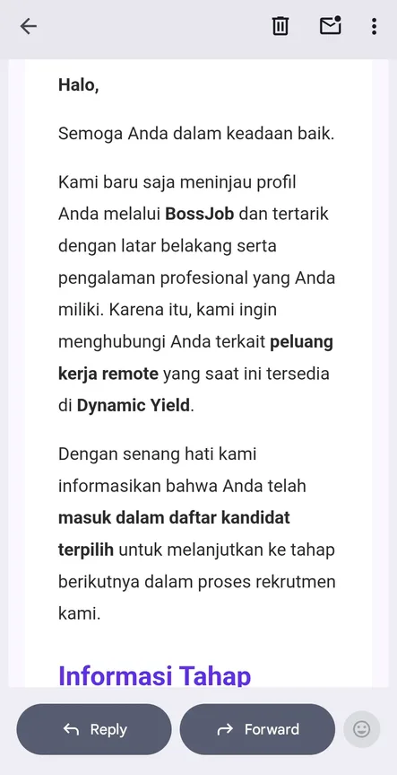
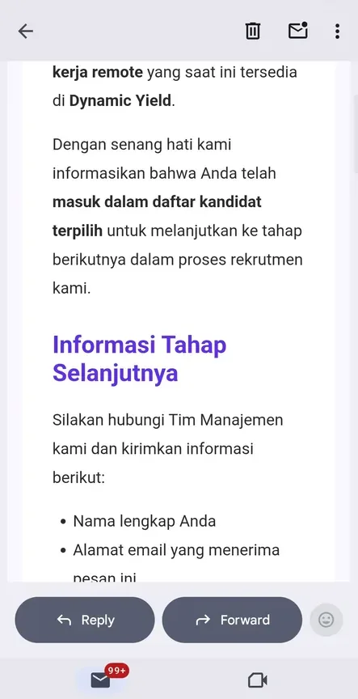
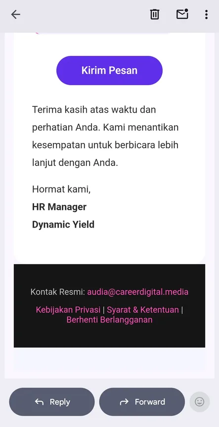
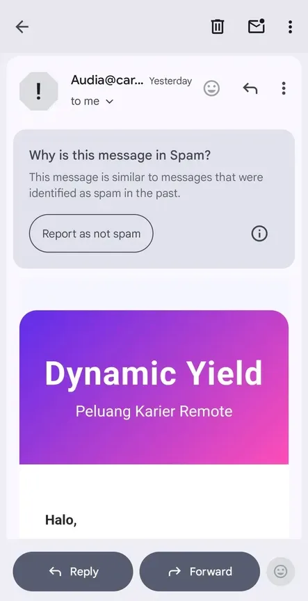
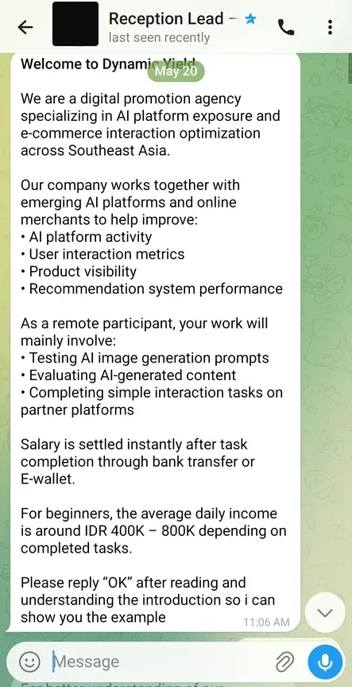
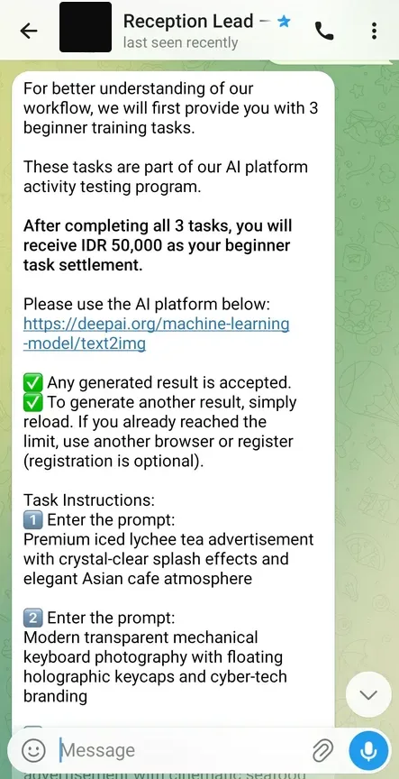
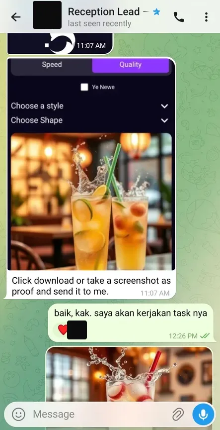
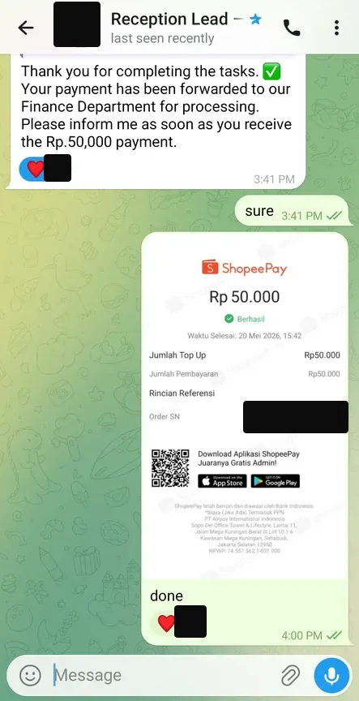

Ada yang DM aku. Dapet email keterima kerja remote jadi AI trainer.. tasknya udah dikerjain, duitnya udah masuk. Dua kali.

Yang bikin dia curiga malah kebalikannya.. dia dibayar, tapi transferannya dari 2 rekening bank yang beda.

Aku bales pendek aja:

> mutlak scam

Dia nanya cara taunya gimana. Aku minta dia ceritain dulu dari awal sampe abis.

> monggo selesaiin dulu ya ceritanya.. nanti aku kasih poin-poin flagnya

Screenshot di bawah aku pakai atas izin dia. Semua yang bisa nunjukin dia siapa udah aku tutup.

## Ceritanya

Awalnya ada email masuk. Katanya profilnya baru ditinjau lewat BossJob, ada peluang kerja remote di Dynamic Yield, dan dia udah MASUK DAFTAR KANDIDAT TERPILIH.

Dia ga pernah apply ke situ. Emang pernah pakai portal itu, tapi udah lama banget ga dibuka. Jadi dia mikir ini undangan kerja. Dan emang bener kok, di portal-portal kayak gitu bisa aja diundang tanpa apply.

Di bawahnya dia disuruh hubungi "Tim Manajemen", terus kirim nama lengkap + alamat email yang menerima pesan ini.

Ditandatangani HR Manager, Dynamic Yield. Kontaknya `audia@careerdigital.media`. Besoknya dichat lagi pakai email lain.. `audiariyanti62@gmail.com`.

Oiya. Emailnya sendiri nyangkut di folder Spam.

Dari email, dia diarahin ke Telegram. Akunnya nama "Reception Lead". Pitchnya: agensi promosi digital, kerjanya testing prompt AI image, bayaran cair instan abis task selesai, rata-rata IDR 400K-800K per hari buat pemula.

Tasknya: buka deepai.org, masukin 3 prompt yang udah disiapin (es leci, keyboard mekanik, seafood), screenshot hasilnya, kirim ke Telegram. Selesai 3 task = Rp 50.000.

Baca lagi barisnya: "Any generated result is accepted."

Abis itu diminta kirim Nama Lengkap, Nama Bank atau E-Wallet, Nomor Rekening, Umur.

Dia pilih e-wallet, bukan rekening bank. Alasannya masuk akal sih.. uang gedenya ada di rekening, jadi e-wallet dianggap lebih aman.

Terus duitnya beneran masuk. Rp 50.000 ke ShopeePay.

Task kedua selesai, dibayar lagi. Rekeningnya beda. Nah di situ dia baru berhenti.

Nomor HP dan emailnya udah mereka pegang. OTP belum pernah dikirim. Untung.

## Flagnya

### 1. HR ngatasnamakan Dynamic Yield, tapi emailnya `careerdigital.media` dan Gmail pribadi

Ini udah janggal. Ga mungkin lowongan kerja legit atas nama perusahaan tapi yang email pake email pribadi.

Oiya, Dynamic Yield itu perusahaan beneran. BossJob beneran, deepai.org juga beneran. Mereka cuma dicatut aja. Makanya pas di-Google semuanya ketemu, jadi keliatan nyambung. Padahal ya ga nyambung.

### 2. Dia yang katanya keterima kerja, tapi dia yang disuruh lapor balik nama lengkap dan email penerima pesan

Artinya itu email blast yang dikirim ke ratusan / ribuan email hasil crawling by robot. Mereka sendiri ga bakal ngenali 1 1 pesan itu udah dikirim ke email siapa aja.

Kalo ada yang melakukan ini, berarti udah jadi mangsa.

Mereka: "Naah dapet ini ikan 1"

### 3. Diarahkan ke Telegram

Tidak ada company legit manapun yang ngasih task dll di Telegram. Yaa ada beberapa pengecualian. Tapi sekarang sebagian besar scam.

Lihat profilnya, fotonya, gaya bicaranya. Dari chat-chatnya itu, keliatan orangnya ga konsisten sama bahasanya sendiri. Aku yakin interaktifnya hanya beberapa chat aja, sisanya kayak ngomong sama robot. Dan bener.. balesannya rata-rata ga sampe 1 menit.

### 4. Task sama sekali ga nyambung

- Ngerjain task di platform lain, gaada submission lewat platform apapun dan gaada pengecekan apapun. Semua report by Telegram.
- Tasknya sendiri ultra aneh itu. Kalo mereka udah bisa ngelakuin sendiri, ngapain nyuruh orang?

Dia sempet mikir "kan platform AI-nya pakai DeepAI itu". Bener, DeepAI-nya beneran. Tapi hasil generate-nya dikirim ke Telegramnya orang yang ngerekrut dia, yang di awal ngaku HR. Bukan ke platform / aplikasi apapun yang bisa kita anggap sebagai AI-nya.

Itu generate gambarnya doang. Terus disubmit ke Telegram ybs 😂

Dan liat lagi "any generated result is accepted". Ga ada quality control sama sekali. Ya iyalah.. hasilnya emang ga dipake buat apa-apa.

Udah. Itu semua keanehannya.

## Terus ujungnya mereka mau apa?

Sejauh ini, mereka itu memastikan kamu patuh sama instruksi-instruksi mereka tanpa curiga. Apalagi udah dibayar.

Next mereka akan nyuruh kamu login-login dan minta OTP dan semacamnya. Dari situ itu nguras rekening.

Nomor ShopeePay-nya udah dikasih. Kemungkinan mereka akan coba login, terus klik lupa password, terus minta kamu kirim OTP yang masuk ke email/HP kamu itu ke Telegram mereka.

Mungkiin. Aku sendiri ga tau sih, belum pernah diceritain orang yang udah kena scamnya :v

Yang jelas Rp 50.000 di awal itu bukan gaji. Itu cuma buat bikin kamu percaya terus nurut.

## Kalo udah terlanjur

Blok Telegramnya. Blok dua-duanya email pengirimnya. Bodo amat~

Duit yang udah masuk GA USAH DIBALIKIN. Kalo mau nutup, satu pesan cukup:

> "I've done the job and received the payment. Thanks a lot. I think I'll stop here. Thanks for the opportunity"

Ga usah nunggu konfirmasi mengundurkan diri segala. Yaa prank balik aja.

> "I resign, bye"

Terus siap-siap. Kemungkinan bakal diteror anyway sampe kamu ngikutin scamnya mereka.

- ditelpon nomer tak dikenal - block
- diemail - block

Yang penting orang sekitar kamu ga kena teror juga. Main block aja udah. Mereka bakal capek sendiri kok.

Aku pernah digituin. Diteror, ngaku-ngaku polisi, minta shareloc. Aku block berulang-ulang. Mereka capek sendiri 😂

JANGAN PERNAH KIRIM OTP. Ke siapapun.

## Mindset dari aku

1. Gaada kerjaan gampang langsung cair cair gitu. Wajib waspada.
2. Coba double check semua profil dan kredibilitas pihak-pihak yang disebut. Di kasus ini ada: careerdigital.media, deepai.org, BossJob, Dynamic Yield. Terus cari korelasinya. Nyambung ga sih mereka ini.
3. Coba lebih kritis untuk menanyakan banyak hal sebelum ngelakuin apa yang mereka instruksikan.

Soal poin 3.. dia bilang sebenernya dari awal udah pengen nanya-nanya, cuma takut kesannya kebanyakan nanya. Jadi diem aja.

Padahal di kerjaan beneran, banyak nanya itu bagus kok. Ga usah takut.

## Kalo AI trainer beneran, tasknya kayak gimana?

Aku kan juga train AI image. Bedanya jauh.

Tasknya susah. Kita udah disuguhi task yang super detail.

1. Task yang harus dikerjakan udah jelas. Objek yang difoto apa, cara fotonya gimana.
2. Foto cuma bisa dilakukan DI DALAM APLIKASI MEREKA dan harus pake kamera. Ga boleh ambil dari galeri.

Kenapa ini masuk akal.. ini literasi IT:

Akan ada misalkan 10 juta orang submit foto dengan prompt yang sama. "Foto tali kamera di atas meja."

Dari 10 juta gambar itu, AI akhirnya bisa mengenali mana meja, mana tali kamera. Jadi kalo suatu saat AI ini dapat prompt dari user "buatkan aku foto tali kamera di atas meja", AI jadi bisa bikin gambar, karena udah ditraining dari 10 juta gambar tadi.

Makanya harus pake kamera, ga boleh dari galeri. Yang dibutuhin itu foto asli dari dunia nyata.

Sekarang bandingin sama task di atas. Di sana malah disuruh GENERATE gambar pake AI orang lain, terus hasilnya dikirim ke Telegram orang. Ga ada foto asli yang masuk ke AI manapun. Kebalik.

Oiya, faktanya aku belum ngerjain 1 pun karena males WKWKKWKWKWKKWKWKW susah. Tapi aku tau itu legit karena cara kerja AI memang begitu.

---

Dia sempet minta maaf gara-gara ngerasa telat nyadar.

Gapapa. Memang AI ini literasi buat orang IT kayak aku. Orang non IT bisa lengah karena memang awam.
